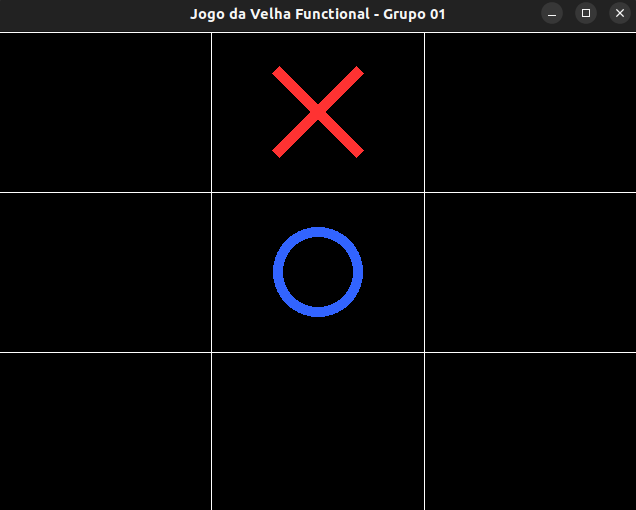

# 2023.2_G1_Funcional

**Disciplina**: FGA0210 - PARADIGMAS DE PROGRAMAÇÃO - T01 <br>
**Nro do Grupo (de acordo com a Planilha de Divisão dos Grupos)**: 01<br>
**Paradigma**: Funcional<br>

## Alunos
|Matrícula | Aluno |
| -- | -- |
| 22/2015103  |  Debora Caires de Souza Moreira |
| 18/0016067  |  Erick Levy Barbosa dos Santos |
| 20/2016480  |  Hellen Fernanda Mendonça de Faria |
| 19/0090901  |  Laura Pinos de Oliveira |
| 21/2005426  |  Lucas Gomes Caldas |
| 20/0073249  |  Pedro Vitor Augusto de Jesus |
| 18/0011472  |  Rodolfo Cabral Neves |
| 18/0027352  |  Rodrigo Carvalho dos Santos |
| 19/0037997  |  Sidney Fernando Ferreira Lemes |


## Sobre 
O projeto é uma implementação do jogo da velha em Haskell utilizando programação funcional. Ele é dividido em quatro módulos:

1. Game.hs: Define a estrutura do jogo, incluindo o estado do tabuleiro e a lógica para jogadas. Permite aos jogadores realizar movimentos válidos e verifica o resultado do jogo.
2. Logic: Contém a lógica central do jogo, determinando vitória, empate e outras regras fundamentais.
3. Rendering: Trata da representação visual ou textual do jogo, exibindo o tabuleiro e informando o estado atual após cada jogada.
4. Main: Ponto de entrada do programa, coordena a execução geral do jogo, inicializando-o, alternando jogadores e controlando o fluxo até um vencedor ou empate.

## Screenshots




## Instalação 
**Linguagens**: Haskell<br>
**Tecnologias**: stack, gloss<br>

## Uso 

### Comandos para distros baseados em Ubuntu

```bash
    sudo apt install haskell-platform stack ghc-OpenGLRaw-devel ghc-GLURaw-devel -y
    
    # Entre na pasta do jogo
    cd jogo-da-velha
    
    # compila o projeto
    stack build

    # executa o projeto
    stack exec jogo-da-velha-exe
```

## Vídeo
<!-- Adicione 1 ou mais vídeos com a execução do projeto.
Procure: 
(i) Introduzir o projeto;
(ii) Mostrar passo a passo o código, explicando-o, e deixando claro o que é de terceiros, e o que é contribuição real da equipe;
(iii) Apresentar particularidades do Paradigma, da Linguagem, e das Tecnologias, e
(iV) Apresentar lições aprendidas, contribuições, pendências, e ideias para trabalhos futuros.
OBS: TODOS DEVEM PARTICIPAR, CONFERINDO PONTOS DE VISTA.
TEMPO: +/- 15min -->

## Participações
Apresente, brevemente, como cada membro do grupo contribuiu para o projeto.
|Nome do Membro | Contribuição | Significância da Contribuição para o Projeto (Excelente/Boa/Regular/Ruim/Nula) |
| -- | -- | -- |
| Debora Caires de Souza Moreira    |  | Regular |
| Erick Levy Barbosa dos Santos     | Estudei implementação gráfica em Haskell e apliquei os diferentes tipos de typecast. Enfrentei grandes dificuldades com entradas e saídas (IO) para conversão de imagem. Utilizei o Gloss para aprender, principalmente usando pixel art. Posteriormente, decidi testar a biblioteca FunGen, e em sua maioria, achei a linguagem bastante complicada devido à sua tipagem, pois requer um sólido conhecimento sobre os tipos de dados inteiros. | Boa |
| Hellen Fernanda Mendonça de Faria |  | Regular |
| Laura Pinos de Oliveira           | Participei da implementação do jogo da velha, incluindo a lógica de jogo, a interação do jogador e a funcionalidade geral do jogo. Creio que poderíamos ter ido além com nosso projeto mas nas próximas etapas iremos nos programar para diminuição das limitações | Regular |
| Lucas Gomes Caldas                 | Estudei a linguagem funcional Haskell e separei a estrutura de encapsulamento do jogo na Game.hs e iniciei uma possível evolução de interface na Main.hs para numero que o usuário possa escolher o tamanho do tabuleiro, se é 3x3, 4x4 e assim por diante. | Boa |
| Pedro Vitor Augusto de Jesus      | Durante o projeto, tive a oportunidade de me familiarizar com a linguagem Haskell. No entanto, enfrentei alguns desafios significativos devido à dependência Graphics.Gloss. Embora tenha tentado várias soluções online, acabei encontrando obstáculos que me limitaram. Nesse momento, busquei parear com o Sidney e com o Lucas no desenvolvimento do módulo 1, conhecido como o "Game Module". Minha contribuição principal foi a criação de artefatos que melhoraram significativamente a documentação e a organização do repositório como um todo. Isso incluiu a implementação de padrões de contribuição, a aplicação de licenças adequadas, a definição de códigos de conduta e a criação de boards para o acompanhamento do progresso.
Assumi a responsabilidade de desenvolver um bot que tornaria possível jogar de forma autônoma. Infelizmente, encontrei desafios significativos ao tentar avançar nesse projeto e não consegui fazer progressos consideráveis.
 | Boa |
| Rodolfo Cabral Neves              |  | Regular |
| Rodrigo Carvalho dos Santos       | Apresentei opções de desenvolvimento com connect4, implementei o render do jogo da velha, e ajustei as versões e controle de dependências do stack. Tentei ajudar o colega Erick Levy com a importação de assets  ao jogo para diferenciar o projeto, infelizmente sem sucesso. Aprendi muito utilizando linguagem funcional, que até o momento era uma novidade pra mim, e passei muita raiva também com a forte tipagem da linguagem.<br>No geral eu considero minha participação como boa, e pretendo não apenas melhorar para próxima, como começar mais cedo. | Boa |
| Sidney Fernando Ferreira Lemes    | Eu participei ativamente no processo de brainstorming de ideias e nas reuniões de grupo para discutir o projeto. Fui responsável por implementar a minha parte designada e explorei oportunidades para adicionar novas funcionalidades, embora tenham sido viabilizadas com sucesso. | Regular |

https://github.com/orgs/UnBParadigmas2023-2/projects/2/views/1

## Fontes
[Haskel Stack](https://docs.haskellstack.org/)
[[Part 2] Tic-tac-toe Game in Haskell -- Procedural vs Functional](https://www.youtube.com/watch?v=VxLvaHpAK-U&t=263s)
